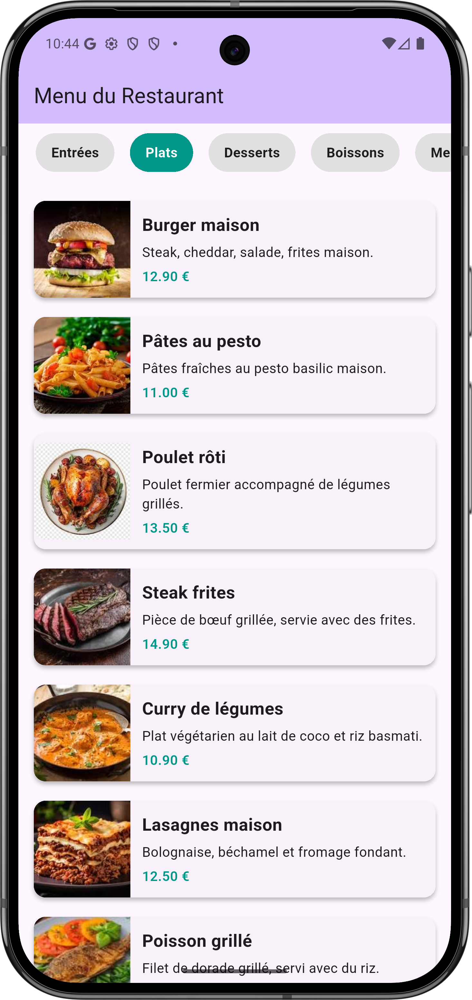

# TP Flutter – Menu d’un Restaurant

Ce projet Flutter a été réalisé dans le cadre du TD "Layouts & Scrolls" dont l’objectif est de mettre en pratique les notions de `Row`, `Column`, `ListView`, `Card`, et de construction d’interfaces responsives.

## Objectifs pédagogiques

- Maîtriser les layouts imbriqués (`Row`, `Column`, `Expanded`, `Card`, etc.).
- Savoir construire une interface scrollable horizontalement et verticalement.
- Réutiliser des composants visuels pour afficher des données organisées.

## Contexte

L'application présente le menu d’un restaurant. Les plats sont triés par catégorie (Entrées, Plats, Desserts, etc.), avec une navigation horizontale entre les catégories, et un affichage vertical des plats sous forme de cartes illustrées.

## Structure du projet

- `main.dart` : point d’entrée de l’application.
- `assets/images/` : dossier contenant les images des plats (à créer dans le dossier `assets`).
- `pubspec.yaml` : à modifier pour inclure les images dans les assets.

## Fonctionnalités principales

- Catégories scrollables horizontalement.
- Affichage conditionnel des plats selon la catégorie sélectionnée.
- Fiches de plats avec image, nom, description et prix.
- Utilisation de `ListView.builder` pour performance et flexibilité.

## Lancer le projet

1. Ouvrir le projet dans Android Studio.
2. Vérifier que les images sont bien placées dans `assets/images/`.
3. Vérifier que le fichier `pubspec.yaml` contient bien :

   ```yaml
   flutter:
     assets:
       - assets/images/
   ```

4. Exécuter le projet sur un émulateur ou un appareil connecté.

## Exemple d'interface

Voici un aperçu attendu de l’application :

